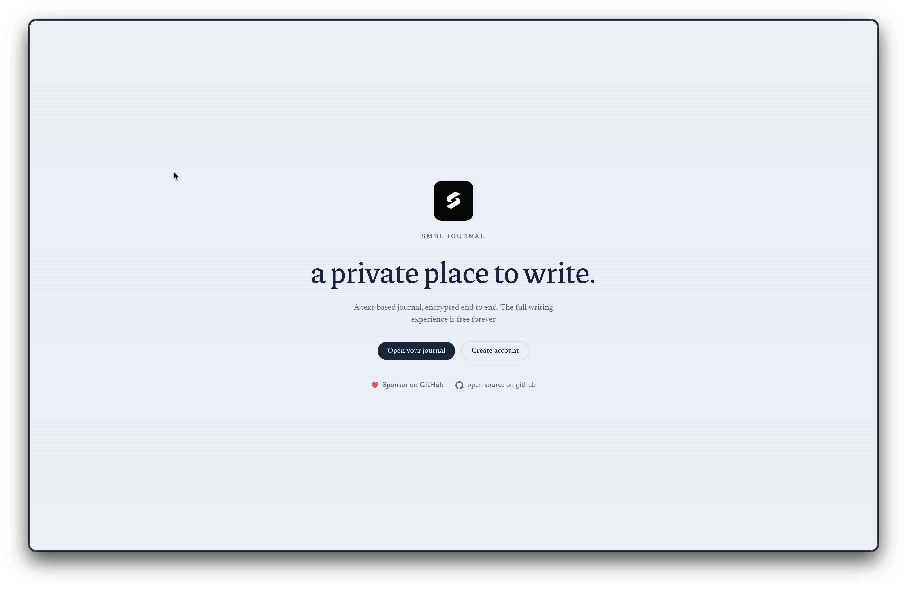

# smbl journal



A private, end-to-end encrypted journal and its open source and **free to use forever**.

The complete text-based journal is free, no limits. Paid plans (if they come) will cover extras like attachments and rich media

## Stack

- **Web:** SvelteKit + TailwindCSS v4
- **API:** Rust + Axum
- **DB:** Turso Cloud (libsql)
- **Auth:** WorkOS (email/password)
- **Encryption:** client-side, mandatory (envelope: Argon2id passphrase key → AES-256-GCM)


## Repo layout

```
apps/web/          SvelteKit app
apps/api/          Rust Axum API
```

## Architecture

Auth uses a **BFF (backend-for-frontend)** pattern. The SvelteKit server is the single place that owns the `httpOnly` session cookie and runs route guards; the Rust API never
sets cookies and only accepts a verified WorkOS session JWT (via `Authorization: Bearer`).

```
Browser ──cookie──► SvelteKit (BFF) ──Bearer JWT──► Rust API ──► Turso
```

The client only ever talks to its own origin (the BFF). Authenticated/private calls are proxied server-to-server to the API, so no browser CORS and no session token exposure in JS.

## Development

```bash
pnpm install
pnpm dev:web    # SvelteKit on :5173
pnpm dev:api    # API on :8080
```

Copy `.env.example` → `.env` in both `apps/api/` and `apps/web/` and fill in.

The API needs a Turso database (`DATABASE_URL`, `TURSO_AUTH_TOKEN`). The web app needs
`API_URL` (server-side), `WORKOS_CLIENT_ID`, and `SECURE_COOKIES=false` for local dev.

## Auth: embedded (self-hosted) screens

Auth is **embedded** — login, signup, and email verification are rendered on our own
domain (`/login`, `/signup`, `/verify-email`). The SvelteKit BFF calls the WorkOS
User Management API (via the Rust API) directly; WorkOS never hosts the UI and no
AuthKit/custom AuthKit domain is required. Email verification is **required**.

### Flow

- **Signup** → `POST /signup` creates the user (unverified) via WorkOS, triggers the
  email verification one-time code, and stores a `pending_authentication_token` in an
  `httpOnly` cookie.
- **Verify** → `/verify-email` shows a code-entry form. Submitting the emailed code
  exchanges it + the pending token for a session and sets the cookie.
- **Login** → `POST /login` calls WorkOS `authenticate_with_password`, sets the
  `smbl.session` cookie, redirects to `/home` or `/setup`. If a user's email was never
  verified, they're routed to `/verify-email` (WorkOS emails a fresh code).
- **Password reset** → `/forgot-password` requests a token via WorkOS (WorkOS emails
  the reset link); `/reset-password?token=…` sets a new password via
  `confirm_password_reset`.
- **Logout** → revokes the WorkOS session server-side (via the Rust API) and clears
  the cookie; no redirect to WorkOS.

### WorkOS dashboard setup

For each environment, in **Applications → your app → Authentication → Email**:

| Setting | Required value |
|---|---|
| Email verification | **Required** |
| Email verification email | **Enabled** (so WorkOS sends the one-time code) |

And set the **Password reset URL** so reset links point to our domain instead of the
hosted AuthKit page: `http://localhost:5173/reset-password` (dev) /
`https://journal.smbl.dev/reset-password` (production).

No redirect/initiate-login/sign-up URIs or custom AuthKit domains are needed — the
browser never leaves our origin during auth.

## Production checklist (Phase 6)

- **Web env** (`apps/web/.env`): `API_URL=https://api.smbl.dev`,
  `PUBLIC_API_URL=https://api.smbl.dev`, `WEB_ORIGIN=https://journal.smbl.dev`,
  `WORKOS_CLIENT_ID=<prod client>`, `SECURE_COOKIES=true`.
- **API env** (`apps/api/.env`): `CORS_ORIGINS=https://journal.smbl.dev`, production
  `WORKOS_CLIENT_ID`/`WORKOS_CLIENT_SECRET`, Turso production DB.
- **WorkOS dashboard**: set email verification to **Required** and the email
  verification email to **Enabled**. No AuthKit/custom domain or redirect URIs.
- **DNS**: `journal.smbl.dev` → Cloudflare Worker (already in `wrangler.jsonc`);
  `api.smbl.dev` → Hetzner VPS (Caddy TLS).
- **HTTPS everywhere** — WorkOS rejects `http` redirect URIs in production.


## LICENSE
MIT
